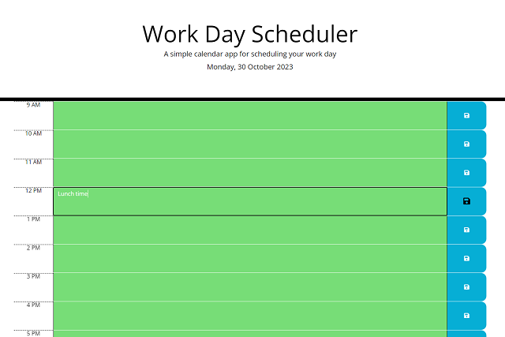

# Work Day Scheduler

A one-page calendar application to allow a user to save events in a working day. The application layout is generated using javascript (jQuery) and uses the DayJS library to facilitate time calulations.
Bootstrap is used for the layout with some custom mobile styles.
Browser localStorage is used to persist tasks between visits and a 'clear schedule' button has been added to clear the scheduler ready for use the next day. 

## Usage

View on GitHub Pages here: [https://webtam81.github.io/Work-Day-Scheduler/](https://webtam81.github.io/Coding-Quiz/). Fill in the task box then click on the save icon to save the task. 

## License

MIT License. See license file for further details.